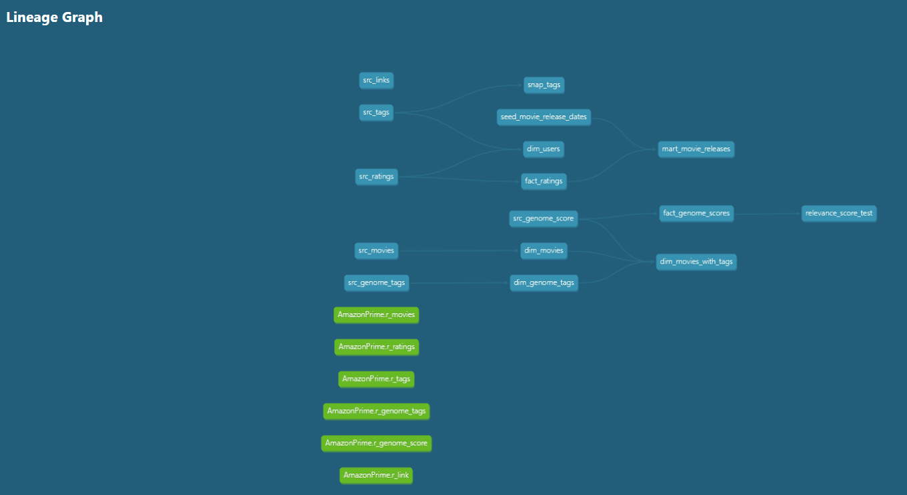
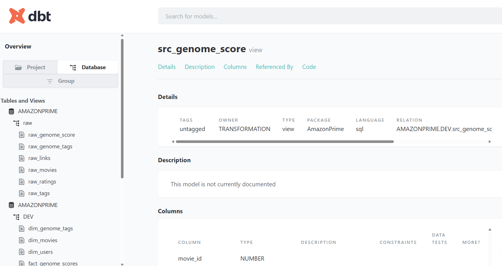

# Dbt-modelling-with-Snowflake
A guide to building a modern data warehouse with Snowflake, using dbt for transformation logic and Amazon S3 bucket for storage

## Project Overview

This project involves:

1. **Data Architecture**: Designing a Modern Data Warehouse Using **raw**, **Staging**, and **Dev** layers on dbt.
2. **ETL Pipelines**: Extracting, transforming, and loading data from source systems in S3 to Snowflakes with Data transformation, Testing and orchestration
3. **Data Modeling**: Developing fact and dimension tables optimized for analytical queries.
4. **Analytics & Reporting**: Creating SQL-based reports and dashboards for actionable insights on Microsoft Power BI

## Architecture

The architecture for this project follows Medallion Architecture **raw**, **Staging**, **Dev**, and **Prod** layers:

.png)

## Resources
1. **Free Snowflake Account**: https://signup.snowflake.com/
2. **S3 bucket & IAM Role**: https://aws.amazon.com/s3/
3. **Dbt models**: https://docs.getdbt.com/docs/build/models
4. **Dbt Materializations**: https://docs.getdbt.com/docs/build/materializations
5. **Dbt Seeds**: https://docs.getdbt.com/docs/build/seeds
6. **Dbt Macros**: https://docs.getdbt.com/docs/build/jinja-macros
7. **Dbt Sources**: https://docs.getdbt.com/docs/build/sources
8. **Dbt snapshot**: https://docs.getdbt.com/docs/build/snapshots
9. **Dbt Documentation**: https://docs.getdbt.com/docs/build/view-documentation
10. **Dbt Test**: https://docs.getdbt.com/docs/build/data-tests

## DBT Documentation

Here, dbt can provide overall view of data model and lineage using the following commands:

- dbt docs generate
- dbt docs serve

